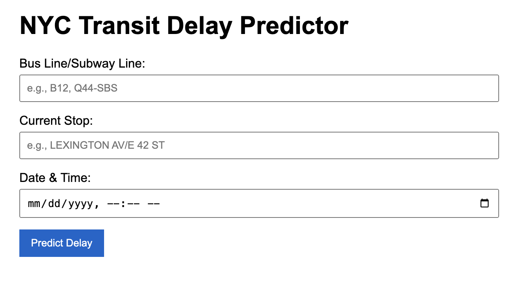
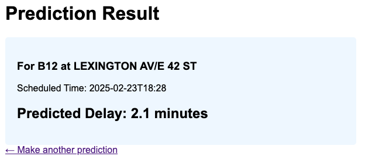

# NYC Transit Pulse

Predicting NYC public transit delays using machine learning.

Developed in 36 hours at the **UCSB Datathon 2025: DataOrbit**.

## Overview
NYC Transit Pulse is a machine learning-powered system that forecasts delays in New York City’s MTA buses and trains using historical transit data. With both a web interface and REST API, it's designed for commuters, planners, and developers alike.

## Features

- Delay prediction for buses
- Time-based predictions using temporal features
- Web interface and REST API endpoints
- Automated data preprocessing pipeline
- Machine learning backend trained on real MTA data

## Technologies

- Python 3.8+
- Flask (Web Framework)
- scikit-learn (Machine Learning)
- pandas (Data Processing)
- Kaggle Hub (Dataset Management)

## Installation

1. **Clone Repository**
```bash
git clone https://github.com/alexyan1/nyc-transit-delay-predictor.git
cd nyc-transit-delay-predictor
```

2. **Create a virtual environment (optional)
```bash
python -m venv venv
source venv/bin/activate
```

3. **Install Dependencies**
```bash
pip install -r requirements.txt
```

4. **Run the web app**
```bash
python app.py
```

## Dataset
Historical MTA delay and schedule data was sourced from:
- Kaggle: [New York City Bus Data]([url](https://www.kaggle.com/datasets/stoney71/new-york-city-transport-statistics?))

## Model Details
The system uses:
- Time-series features (day, hour, weekday/weekend)
- Huber Regression model
- Evaluation metrics: Accuracy, MAE
- The pre-trained model is in delay_pipeline.pkl
- It can be trained in the file `rlm.py`

## API Endpoints

Example:
`
curl -X POST http://localhost:5000/predict \
     -H "Content-Type: application/json" \
     -d '{
           "stop": "5th Ave",
           "line": "M4",
           "datetime": "2025-04-23T08:30"
         }'
`

Response:
`
{
  "stop": "5th Ave",
  "line": "M4",
  "predicted_delay": 5.2,
  "units": "minutes"
}
`

## Screenshots


